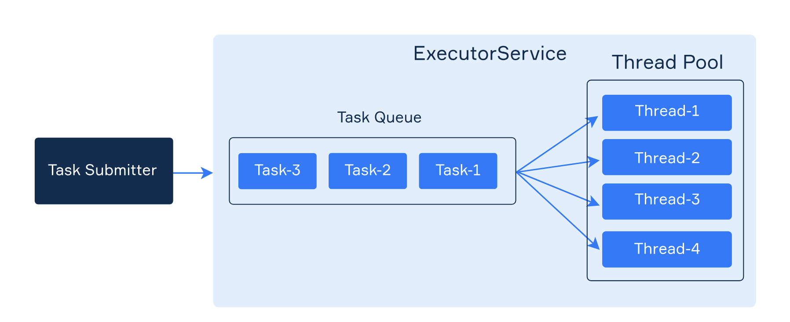

# Executors

### Problem 1: Mail

Some operations, like email sending, are often performed in a background thread. It allows reducing the load for main threads.

Here is the `MailSender` interface and the `MockMailSender` class, which simulate mail sending.

Implement the `asyncSend` function by iterating through `messages` and sending them via `sender`. Use a single thread pool executor, and do not forget to shut it down.

### Problem 2: Message System

Write a program that simulates a simple message system. Each message has three fields: `from`, `to`, and `text`.

The interface `AsyncMessageSender` describes an abstraction that can send messages and stop its work.

The class `AsyncMessageSenderImpl` implements this interface and repeats each message several times (according to a variable).

Complete this class. It should:
* use ExecutorService to send multiple messages in parallel;
* implement repeating of messages in the sendMessage function;
* implement the stop function to shut down the executor and wait until it stops (it means blocking the thread that invokes it).

Here is the output:
```
(John>Mary): Hello!
(John>Mary): Hello!
(John>Mary): Hello!
(Clara>Bruce): How are you today?
(Clara>Bruce): How are you today?
(Clara>Bruce): How are you today?
Completed.
```

The order of the sent messages may be different, but the last line must remain the last.

### Problem 3: Custom Thread Pool

In this task, you will implement your own **thread pool** in Kotlin`. 



The goal is to understand:
* how threads can be managed
* how tasks are queued and executed
* how synchronization works in a concurrent environment

### ✅ Requirements

- The thread pool should accept a fixed number of worker threads.
- It should implement the `Executor` interface (`fun execute(command: Runnable)`).
- Tasks should be queued in a thread-safe structure.
- Threads should wait for new tasks when idle (using `Condition.await()`).
- When a new task is added, a waiting thread should be signaled (using `Condition.signal()`).
- Provide a `shutdown()` method to stop accepting new tasks and gracefully shut down all worker threads.


